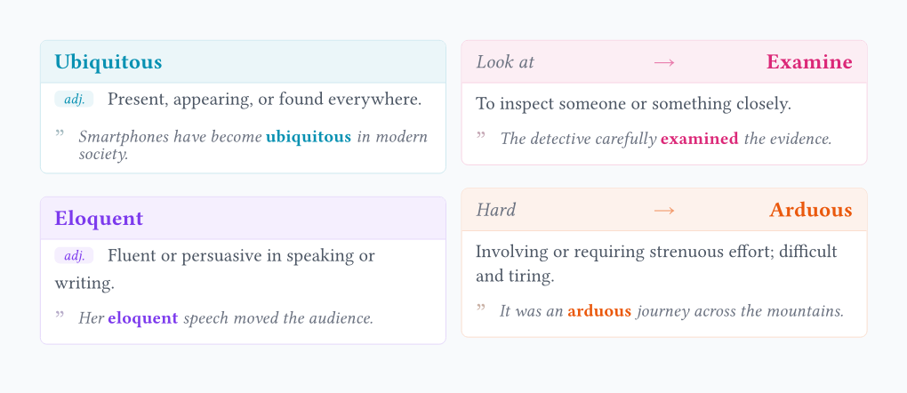

# wordc

A beautiful and compact vocabulary card package for Typst. 
Perfect for creating vocabulary lists, flashcards, and language learning materials.



## Usage

Import the package and start creating cards:

```typst
#import "@preview/wordc:0.1.0": wordc

#wordc(
  "Meticulous",
  pos: "adj.",
  def: "Showing great attention to detail.",
  examples: "He was meticulous about hygiene."
)
```